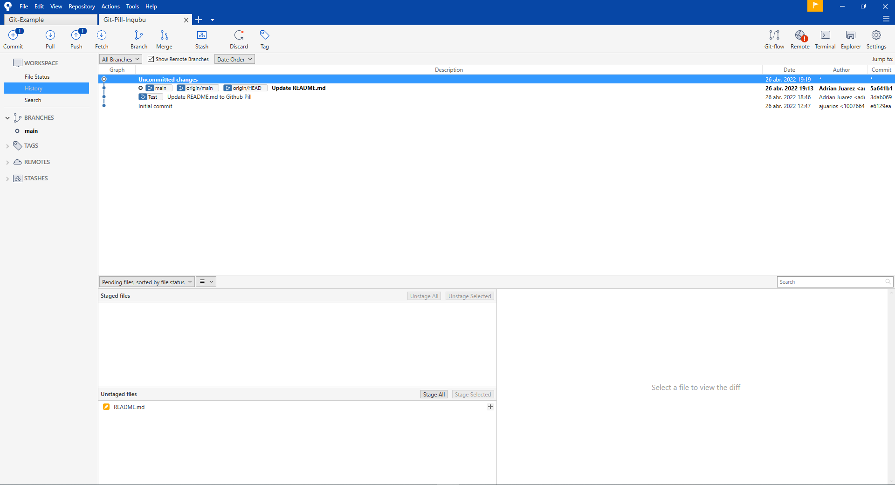
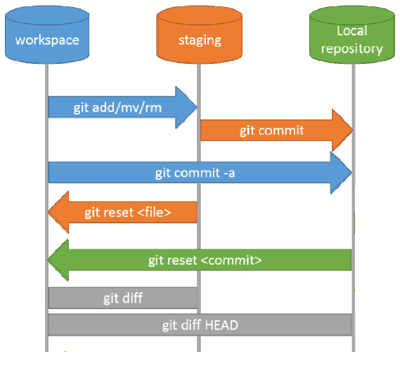
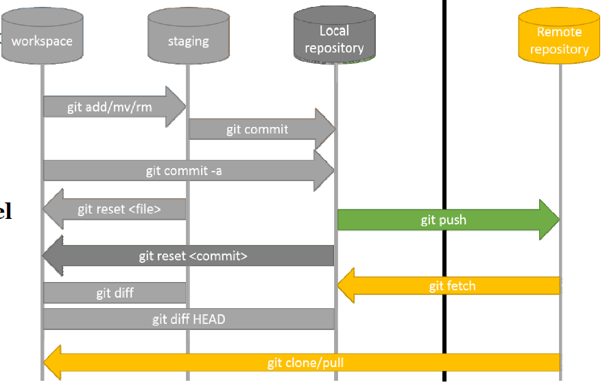
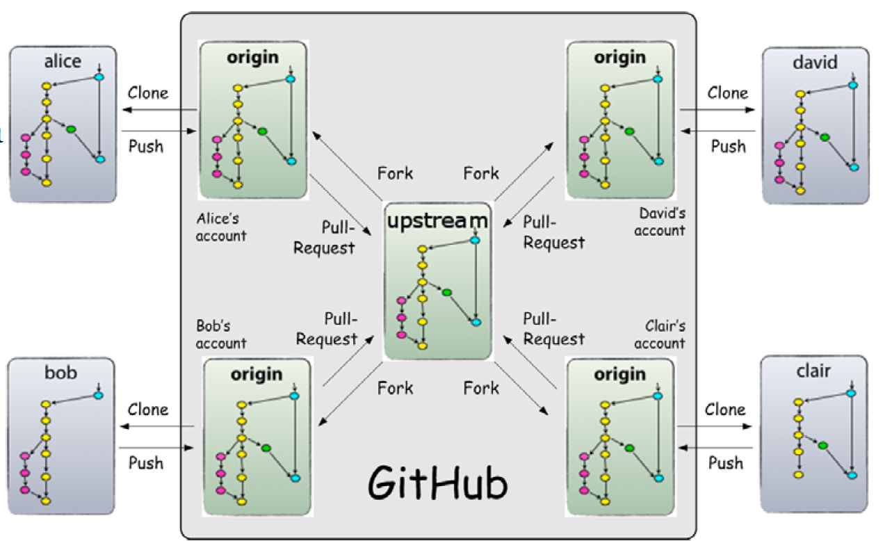
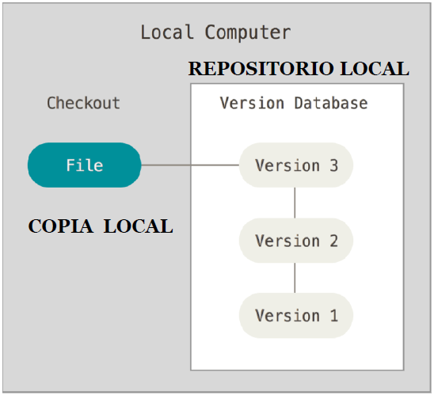
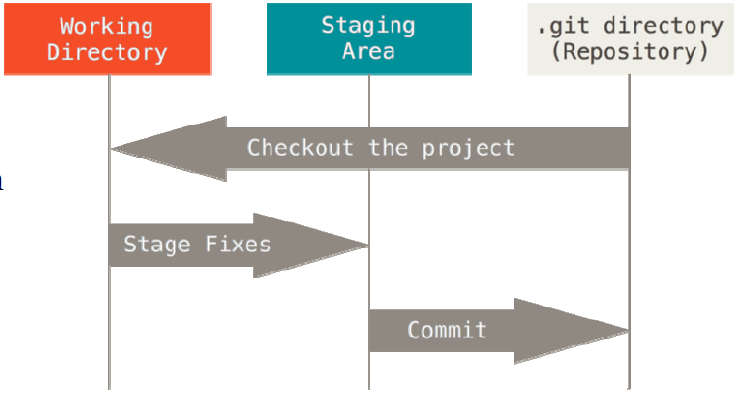

# Git-Pill-Ingubu
Repositorio de ejemplo para la píldora de conceptos básicos de Git

## Contenido
Este proyecto tiene dos ramas: master y develop. **master** contiene el proyecto en su versión más estable y **develop** muestra todas las pruebas que se han realizado para llegar a la última versión

1. [Contenido](#contenido)
2. [Demo](#demo)
3. [Instalación](#instalacion)
4. [Pasos a seguir: tutorial](#pasos-a-seguir-tutorial)
   1. [Crear o clonar un repositorio Git](#1-crear-o-clonar-un-repositorio-git)
   2. [Comprobar el estado del repositorio y añadir archivos al control de versiones](#2-comprobar-el-estado-del-repositorio-y-anadir-nuevos-archivos-al-control-de-versiones)
   3. [Confirmar los cambios mediante commit y añadirlos al HEAD](#3-confirmar-los-cambios-mediante-commit-y-anadirlos-al-head)
   4. [Revisar o deshacer commits ejecutados](#4-revisar-o-deshacer-commits-ejecutados)
   5. [Mostrar el historial de commits](#5-mostrar-el-historial-de-commits)
   6. [Incluir commits en el repositorio principal](#6-incluir-commits-en-el-repositorio-principal)
   7. [Crear, eliminar y enumerar etiquetas en Git](#7-crear-eliminar-y-enumerar-etiquetas-en-git)
   8. [Crear, administrar y eliminar ramas](#8-crear-administrar-y-eliminar-ramas)
5. [Vista previa](#vista-previa)
6. [Notas](#notas)
   1. [Markdown](#markdown)
   2. [Flujo de trabajo](#flujo-de-trabajo)
   3. [Buenas prácticas](#buenas-practicas)
   4. [Operaciones básicas](#operaciones-basicas)
   5. [Conceptos básicos](#conceptos-basicos)

## Demo
Si quieres ver la demostración de este proyecto desplegado, puedes pinchar [aquí][git ingubu]

## Instalación {#instalacion}
En la [página oficial del proyecto Git][web Git], encontrarás los **archivos de instalación binarios**, las **instrucciones para instalar el administrador de paquetes (sistemas Unix)** ylas **ediciones portátiles listas para usar** para cada sistema operativo. Solo tienes que descargar el paquete de instalación deseado o elegir el paquete apropiado mediante el administrador y, a continuación, seguir las instrucciones del asistente. Obviamente, con las ediciones portátiles no es necesario llevar a cabo la instalación.

>**Consejo**: En la [página de descargas de git-scm.com][web git-scm], la comunidad de Git ofrece **diferentes interfaces gráficas** para el sistema de control de versiones. Recomendamos [SourceTree][web sourcetree] al ser una herramienta gratuita muy potente con una interfaz gráfica sencilla.

## Pasos a seguir: tutorial

Una vez instalado Git, ya podemos utilizar el sistema para controlar las versiones de los proyectos. Como con cualquier otro programa, el primer paso es **comprender** las **funciones** y **comandos básicos** para sacarle el máximo partido a la herramienta. En esta completa guía de Git, se explican los comandos más importantes para **configurar y utilizar Git mediante la interfaz de línea de comandos** y que puedas crear y administrar fácilmente tu propio repositorio.

### 1. Crear o clonar un repositorio Git
El repositorio Git es el directorio central de un proyecto y, por lo tanto, también el principal punto de contacto para todos los participantes, a través del cual se lleva a cabo el control de todas las versiones. Por ello, el primer paso consiste en **crear este repositorio principal o clonarlo** (en forma de copia de trabajo) en caso de que vayas a incorporarte a un proyecto que ya se esté gestionando con Git.

Tanto si quieres configurar el control de versiones para un nuevo proyecto como si acabas de instalar Git para aprender a trabajar con la herramienta, debes crear un nuevo repositorio. Para ello, ejecuta el comando cd (change directory) para acceder al **directorio de tu dispositivo donde desees ubicarlo**:
    
    cd 'ruta al directorio del proyecto'

Una vez allí, introduce el siguiente comando para **crear un repositorio _.git_**:

    git init

Si ya existe un repositorio Git para el proyecto, solo tienes que introducir el comando **_git clone_** seguido de **la dirección web o de red de ese repositorio** para crear una **copia de trabajo** en el ordenador:
    
    git clone https://github.com/ajuarios/Git-Pill-Ingubu

### 2. Comprobar el estado del repositorio y añadir nuevos archivos al control de versiones {#2-comprobar-el-estado-del-repositorio-y-anadir-nuevos-archivos-al-control-de-versiones}

Uno de los conceptos básicos para utilizar Git es organizar adecuadamente el propio directorio de trabajo, lo que permite no solo proponer **cambios e innovaciones personales** a un proyecto, que luego son aceptados mediante el comando _git commit_ (enviar), sino también obtener **información sobre las actividades de otros usuarios**. Puedes comprobar si tu copia de trabajo está actualizada ejecutando este comando:

    git status

Por lo general, en el caso de los repositorios creados recientemente, o cuando el repositorio principal y la copia de trabajo coinciden por completo, recibirás un aviso de que no se ha modificado el proyecto (_No commits yet_). Además, Git te informa de que no has compartido tus cambios para el próximo _commit_ (_nothing to commit_).

Para **añadir** un nuevo **archivo al control de versiones** o para **registrar** algún cambio **para el siguiente _commit_**, introduce el comando **_git add_** y el nombre de este archivo, que debe encontrarse en tu directorio de trabajo. En esta guía, añadiremos un documento de texto llamado “Test” como ejemplo:

    git add Test.txt

Después, cuando vuelvas a comprobar el estado del repositorio, verás que el documento está a la espera de someterse a la **siguiente fase de confirmación de cambios** del proyecto, en que estos se aceptarán o no (_Changes to be commited_):

### 3. Confirmar los cambios mediante commit y añadirlos al HEAD {#3-confirmar-los-cambios-mediante-commit-y-anadirlos-al-head}

Cualquier cambio que hayas propuesto incorporar al proyecto, como hemos explicado en el punto anterior, debe confirmarse con _commit_ para que **se incluya en el HEAD**. El HEAD es una especie de índice que apunta al último _commit_ efectuado en el entorno de trabajo Git actual (también llamado “rama”). El comando para hacerlo es el siguiente:

    git commit

>**Nota:**
Antes de ejecutar el comando _git commit_, no te olvides de comprobar si has marcado todos los cambios que deseas incluir en el repositorio remoto (con _git add_). De lo contrario, estos serán ignorados, incluso si se encuentran en la copia de trabajo guardada en el directorio.

Después de ejecutar el comando, Git **inicia automáticamente el editor** que configuraste como predeterminado durante la instalación o que el propio sistema abre por defecto. En el documento, puedes añadir un **comentario personal** sobre el commit planificado, en el que las líneas anotadas se separan por punto y coma y, por lo tanto, no se muestran más adelante. En cuanto **cierres el editor**, Git creará el _commit_.

>**Nota:**
> Si no se abre ningún editor de texto y, por el contrario, permanecemos en el terminal vin, debemos introducir el texto del *commit* en la primera línea. Para salir, pulsamos **ESC** para que aparezca una línea de comandos al final del prompt e introducimos **:x**.

Al ejecutar *git commit*, obtienes un mensaje que resume el *commit*: entre corchetes figuran, por un lado, el **nombre de la rama del proyecto** a la que se transfirieron los cambios (en este caso, _master_, ya que nuestro repositorio de trabajo también es el repositorio principal) y, por otra parte, la **suma de comprobación SHA-1** del _commit_ (en este caso, _c0fdc90_). Les siguen el comentario que anotó el propio usuario (aquí, “Test”) y algunos datos concretos sobre los cambios.

### 4. Revisar o deshacer commits ejecutados

Una vez aceptados los cambios mediante el comando commit, puedes editar el contenido o eliminarlo por completo en cualquier momento más adelante. Por ejemplo, un caso típico sería precipitarse al ejecutar commit y olvidarse de algún archivo o configuración importante. En este caso, puedes registrar archivos nuevos o modificados ***a posteriori*** mediante el comando *git add* y volver a transferirlos. Para ello, añade ***--amend*** al comando estándar:

    git commit --amend

Si quieres **deshacer** el último **_commit_** generado, puedes hacerlo con el siguiente comando de Git:

    git reset --soft HEAD~1

Este comando cancela el _commit_ registrado por última vez en el HEAD. Los archivos que contiene se **restablecen** como “cambios planificados para el próximo _commit_” en el estado del proyecto. Si lo que quieres es **eliminar por completo** los datos introducidos, ejecuta el siguiente comando en lugar del anterior:

    git reset --hard HEAD~1

### 5. Mostrar el historial de commits
Aprender a gestionar proyectos con Git es especialmente útil debido a las características básicas de control de versiones que ofrece el sistema. Por ejemplo, una gran ventaja de este programa de código abierto es que siempre puedes visualizar los **últimos cambios que se han realizado en el repositorio**. Para ello, puedes utilizar el siguiente comando de Git:

    git log

De manera predeterminada, el comando git log enumera los *commits* generados en orden cronológico inverso: la **suma de comprobación SHA-1**, el **autor** (nombre y dirección de correo electrónico) y la **fecha de cada *commit***. Además, se muestra un **comentario individual** que sirve a todos los usuarios como indicador para poder buscar rápidamente las versiones. En un apartado anterior de este tutorial de Git, generamos un solo *commit* con el mensaje “Test”. Al ejecutar el comando, se nos muestra el archivo solicitado.

El comando *git log* también puede modificarse utilizando varios parámetros. En la siguiente tabla, te mostramos algunas de las posibilidades:

| **Parámetros para git log** | **Descripción**                                                                                                                        |
|-----------------------------|----------------------------------------------------------------------------------------------------------------------------------------|
| -p                          | Muestra también los cambios incluidos en un commit                                                                                     |
| -2                          | Enumera solo los dos últimos commits ejecutados                                                                                        |
| --stat                      | Añade una pequeña estadística a cada registro que muestra qué archivos se han modificado y cuántas líneas se han insertado o eliminado |
| --pretty                    | Cambia el formato de salida con diferentes posibilidades; por ejemplo, --pretty=online enumera todos los commits en una sola línea     |
| --abbrev-commit             | Muestra solo los primeros caracteres de una suma de comprobación SHA-1                                                                 |
| --relative-date             | Muestra la fecha de un cambio en formato relativo (por ejemplo, “hace dos semanas”)                                                    |

### 6. Incluir commits en el repositorio principal

Hasta ahora, hemos mostrado cómo guardar los cambios como *commit* en el HEAD del directorio local. Para que estos también se incluyan en el **repositorio principal**, debes ejecutar el siguiente comando:

    git push origin master

De este modo, **Git transfiere automáticamente todos los *commits* ejecutados**, que hasta ahora solo habían estado en la copia de trabajo, **al directorio principal**, que también recibe el nombre de master. Si sustituyes este nombre por el de otra rama (la del proyecto), los archivos se enviarán directamente allí.

>**Advertencia:** Si no habéis iniciado nunca sesión con vuestra cuenta de git, lo más común es que os salga un mensaje similar a 'error: failed to push some refs to *remote repository*'. Para solventarlo, introduciremos *git pull --rebase* para indicar que la rama principal es *main* y no *master*. Después, introduciremos *git push*, para lo cual nos pedirá iniciar sesión con nuestra cuenta de Git y finalizará la subida al repositorio remoto.

### 7. Crear, eliminar y enumerar etiquetas en Git

Al igual que muchos otros sistemas de control de versiones, Git tiene una función de etiquetado que **resalta los elementos seleccionados en el historial del repositorio**. Por lo general, estas etiquetas se utilizan para identificar versiones del software, como 1.0, 2.0 o posteriores, y permitir que estas sean fáciles de acceder en todo momento, incluso en el caso de los proyectos grandes. Git admite dos tipos de etiquetas:

* **Etiquetas anotadas** (*annotated*): se guardan como objetos independientes en la base de datos e incluyen su propia suma de comprobación, etiqueta, fecha, nombre y dirección de correo electrónico del creador de la etiqueta, así como la firma opcional GNU Privacy Guard (GPG).
* **Etiquetas no anotadas** (*lightweight*):al igual que las ramas, solo sirven de referencia para identificar un commit. Este tipo resulta útil si solo necesitas una etiqueta temporal o si no quieres guardar datos avanzados.

Para crear **etiquetas anotadas** en Git, ejecuta el comando ***git tag -a*** en el *commit* que desees. Si también añades el parámetro ***-m***, podrás anotar entre comillas el mensaje que debe incluir la etiqueta directamente en el símbolo del sistema. En este tutorial de Git, hemos generado el *commit* “Test”, que ahora vincularemos a una etiqueta que incluye el mensaje “example tag”:

    git tag -a Test -m "example tag"

>**Nota**: Si omites el parámetro _-m_ al generar la etiqueta, Git abrirá automáticamente el editor para que puedas introducir el mensaje de la etiqueta.

Para las **etiquetas no anotadas**, procedemos de manera similar: en este caso, solo ejecutamos el comando básico ***git tag*** en el *commit* deseado y no utilizamos ningún otro parámetro. En el ejemplo utilizado en este tutorial de Git, el comando sería el siguiente:

    git tag Test

En cuanto haya etiquetas en el repositorio, podemos mostrarlas con el mencionado ***git tag*** y los parámetros opcionales *-l* o *--list*:

    git tag
    git tag -l
    git tag --list

Para **eliminar una etiqueta del directorio de trabajo local**, ejecuta el comando ***git tag -d***. Nuestra referencia a “Test” se elimina de la siguiente manera:

    git tag -d Test

Ten en cuenta que también debes transferir las etiquetas al repositorio principal de forma manual como *commit*. Para ello, introduce el nombre de la etiqueta y el comando ***git push origin***. También puedes añadir el parámetro ***--tags*** en vez del nombre de la etiqueta, mediante el cual todas las etiquetas generadas se incluyen en el repositorio:

    git push origin --tags

### 8. Crear, administrar y eliminar ramas
Las ramas ya mencionadas en este tutorial de Git no son, en principio, más que **versiones de trabajo individuales del repositorio principal**, que también se clasifica como una rama llamada *master*. Mediante esta estructura, Git proporciona una base perfecta para desarrollar características y funciones de forma independiente y combinarlas en etapas posteriores, lo que también recibe el nombre de **fusionar** (en inglés, *merge*).

**Crear una nueva rama** es fácil: solo debes ejecutar el comando ***git branch*** y añadir el nombre que quieras poner a la rama. Por ejemplo, puedes generar una rama de ejemplo llamada ***test_branch*** de la siguiente manera:

    git branch test_brach

Después, puedes cambiar a esta rama en cualquier momento mediante el comando **_git checkout_**:

    git checkout test_branch

Para combinar dos o más ramas, utiliza el comando ***git merge***. Antes, ejecuta ***checkout*** para cambiar al directorio que debe incluir la otra rama y, después, ejecuta allí este comando, incluyendo el nombre de la rama que se fusionará. Nuestra versión de trabajo test_branch se puede **fusionar con el repositorio principal** de la siguiente manera:

    git checkout master
    git merge test_branch

Si has fusionado varias ramas de trabajo y, por lo tanto, ya no te hace falta una **rama en particular**, puedes eliminarla fácilmente. Para ello, introduce el comando ***git branch -d*** y la rama que ya no necesites. Eliminaremos *test_branch*, nuestro ejemplo en este tutorial de Git, mediante el siguiente comando:

    git branch -d test_branch

El único **requisito para eliminar una rama** es encontrarse en otra distinta en ese momento.

## Vista previa
Aquí debe mostrarse una vista previa del proyecto en cuestión, ya sean diagramas o ejemplos de funcionamiento.

## Notas
### Markdown
Un buen comienzo para escribir en Markdown es seguir el siguiente [**tutorial**][markdown tutorial]

### Flujo de trabajo
En los proyectos, se va a intentar seguir el siguiente flujo de trabajo:
1. La rama *master* contiene el proyecto en su última versión más estable. Únicamente se subirán cambios a esta rama mediante pull-request aprobados por los administradores.
2. La rama *developer* contiene los últimos cambios de los desarrolladores. Esta rama es la que debe hacer peticiones a la *master* cuando se estime oportuno
3. Las ramas *developer-name* únicamente existirán en los repositorios locales de los desarrolladores. Estas ramas deben actualizarse continuamente con la rama *developer* para actualizar los cambios de los compañeros.

### Buenas prácticas {#buenas-practicas}
* Hacer *commits* frecuentes y pequeños (pero no a medias).
* Rellenar siempre un mensaje por cada *commit*:
  * Breve
  * Explicativo
  * En presente (el sujeto de la frase es el cambio realizado)
  * En **INGLÉS**
* Utilizar ficheros ignorados todo lo posible para no contaminar el repositorio.
* Trabajar siempre en el directorio local, es decir, el que está en control de versiones, no en otra aparte.
* Hacer updates (*pulls*) frcuentes para tener una copia local actualizada y evitar emplear mucho tiempo resolviendo conflictos.

### Operaciones básicas {#operaciones-basicas}

#### commit
Confirmar los ficheros preparados para su almacenamiento en el repositorio.

#### checkout
Obtener una copia local descargando un fichero del repositorio. Puede ser de la última versión o de cualquiera de las anteriores. Si se hace sobre un fichero modificado, se descartan las modificaciones sustituyéndose por el que había.

#### add
Realiza una copia de un fichero modificado, poniéndola en la zona de preparación para poder ser confirmada.

#### reset
Es el 'undo' de Git. Puede descartar la copia de la zona de preparación, pero también puede deshacer uno o varios commits (**MUY ÚTIL**) 

#### diff
Compara versiones de ficheros

#### clone
Replica un repositorio entero con todo su historial de cambios y actualiza el directorio local

#### push
Es la operación en la que se envían al repositorio centralizado un *commit* o conjunto de *commits*.

#### pull
Es la operación en la que se actualiza el repositorio local y el directorio local con commits que provienen del repositorio remoto.

#### fetch
Trae commits de un repositorio remoto a un repositorio local, pero no actualiza el directorio local. Se utiliza menos que las otras.

#### merge
Traslada los cambios de una rama a otra.

#### rebase
'Transplanta' sobre un tronco que ha crecido depués de crear la rama.

#### checkout
Saca al directorio de trabajo una rama concreta.

#### pull request (entre ramas)
Petición que hace el desarrollador de una rama para que sus cambios se fundan con la rama principal.

#### fork
Clone que se hace dentro del mismo servidor. Por ejemplo, el repositorio original y el clonado ambos residen en Github o Bitbucket. Al original se le suele llamar ***UPSTREAM***

#### pull request (entre repositorios)
Petición que hace el desarrollador para que los cambios hechos en su repositorio clonado mediante un *fork* sean incorporados al repositorio original.

#### origin
Repositorio remoto que se clona localmente

### Conceptos básicos {#conceptos-basicos}
#### Control de versiones local
Es el que se realiza en una sola máquina. Soportado por todos los sistemas de control de versiones, desde los más antiguos hasta los actuales. Se realiza sobre un directorio y todos sus subdirectorios.

#### Repositorio local
Es una base de datos centralizado donde se guardan las distintas versiones de los ficheros sometidos a control de versiones.

#### Versión (*Commit*)
Cada uno de los cambios que sufre un fichero y que quedan identificados por un número único.

#### Copia local
Es la copia que haces los usuarios de un fichero sometido a control de versiones. El **DIRECTORIO LOCAL** es el que contiene todas las copias locales.

#### LOG
Registro de todos los cambios que se han producido en el repositorio. Es responsabilidad del cliente añadir información al log cuando se produce un cambio

#### Fichero confirmado (*commited file*)
Es el fichero que ya está almacenado en el repositorio. La última versión y la copia local son iguales.

#### Fichero modificado (*modified file*)
Es el fichero modificado en la copia local. Existe una diferencia entre la copia local y la última versión en el repositorio.

#### Fichero preparado (*staged file*)
Es la copia del fichero modificado preparada para ser confirmada en la próxima operación de confirmación (***COMMIT***). La zona de preparación contiene todos los ficheros preparados.

#### Fichero ignorado (*ignored file*)
Es el fichero que está en el directorio local pero que deliberadamente no se somete a control de versiones.

[web sourcetree]: https://www.sourcetreeapp.com/
[web Git]: https://git-scm.com/downloads
[web git-scm]: https://git-scm.com/downloads/guis/
[git ingubu]: https://github.com/ajuarios/Git-Pill-Ingubu
[markdown tutorial]: https://www.markdowntutorial.com/lesson/1